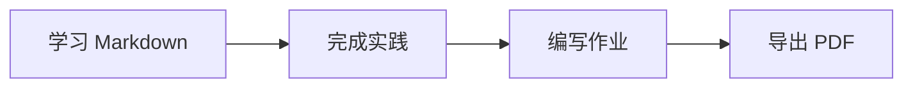
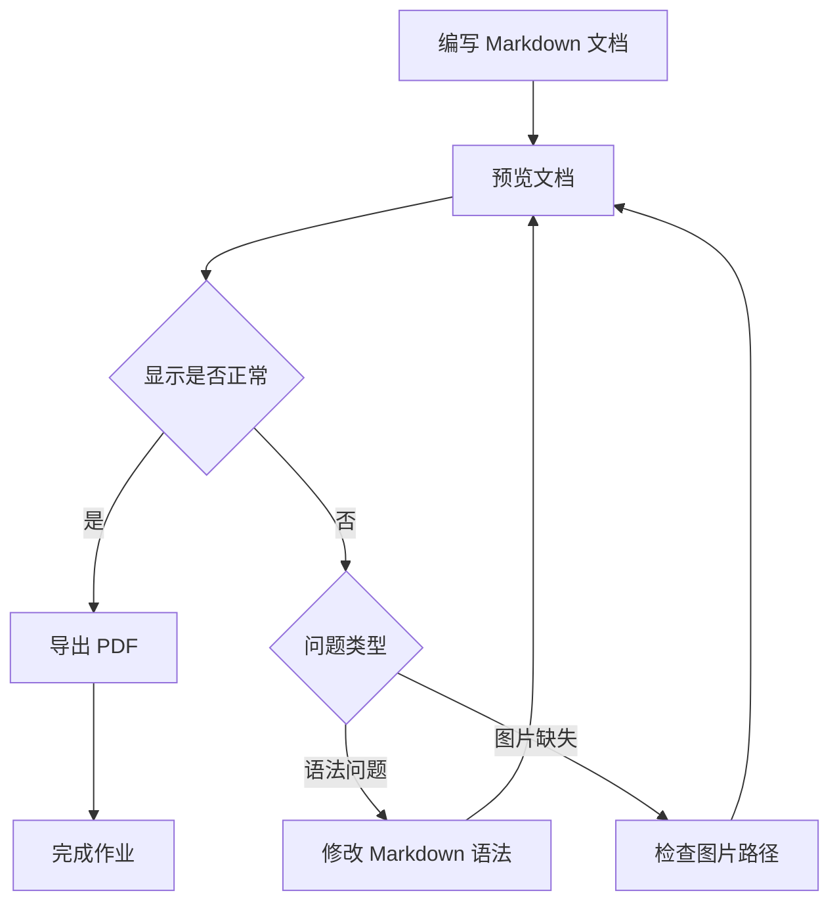

# Markdown 学习与 AIGC 提示词工程实践报告

## 一、作业概述

本次作业的主要目标是学习Markdown的基础语法和高级用法，了解Markdown编辑工具，并研究Markdown在AIGC提示词工程中的应用。

我选择使用ChatGPT作为辅助学习平台，并使用Typora编写Markdown文档。

学习完成后，我将Markdown文档转换为PDF，并发布到GitHub、CSDN。

## 二、AI 平台及提示词

### 2.1 使用的 AI 平台

- 平台：ChatGPT
- 使用日期：2026年9月19日
- 使用目的：学习Markdown和结构化提示词

### 2.2 使用的提示词

> 作为计算机技术专家、人工智能技术专家，网络空间安全专家，
> 密码学专家，密码技术专家，请您：
>
> 1. 深入浅出地讲解Markdown及其详细语法，至少包含标题、列表、
>    链接、表格、代码等内容。
> 2. 推荐至少两款线上工具和至少两款线下工具。
> 3. 讲解Markdown的高级用法，包括插入数学公式、绘图、制作PPT、
>    格式转换等。
> 4. 讲解Markdown在ChatGPT等AIGC提示词工程中的应用。

## 三、Markdown 基础知识学习

### 3.1 Markdown 简介

### 3.1.1 什么是 Markdown

Markdown是一种轻量级标记语言，用来通过一些简单、易读的符号表示文章的结构和格式。

Markdown于 2004 年由John Gruber创建。它的设计目标是让人们能够使用普通文本编写格式清晰的文档，而且即使文档还没有被转换或渲染，直接阅读Markdown源文件也比较容易理解。

Markdown常见的文件扩展名是：

```text
.md
.markdown
```

其中，`.md` 最常用。例如：

```text
README.md
学习笔记.md
实验报告.md
项目说明.md
```

Markdown 文件本质上是一个纯文本文件，可以使用记事本、Visual Studio Code、Typora、Obsidian等软件打开和编辑。

“轻量级标记语言”可以拆成两部分理解：

- **标记语言**：使用特定符号表示标题、列表、链接、图片和代码等内容。
- **轻量级**：语法比较少，符号比较简单，不需要像 HTML 那样编写大量标签。

例如，在 Markdown 中输入：

```markdown
# 我的学习笔记

## 今天学习的内容

- Markdown 标题
- Markdown 列表
- Markdown 链接

我使用的学习网站是 [Markdown Guide](https://www.markdownguide.org/)。
```

渲染后会形成一篇包含一级标题、二级标题、无序列表和超链接的文档：


### 3.1.2 Markdown 是如何工作的

Markdown文档通常需要经过“编写、解析、渲染”三个阶段。

```text
编写Markdown源文件
        ↓
Markdown解析器识别标记
        ↓
渲染为网页、PDF、Word或其他格式
```

第一步是编写Markdown源文件。例如：

```markdown
# Markdown学习

这是我的第一篇Markdown文档。

- 简单
- 清晰
- 易于修改
```

第二步是由Markdown解析器识别其中的符号：

- `#` 表示一级标题。
- 空行用于分隔段落。
- `-` 表示无序列表项。

第三步是渲染。编辑器或网站会把Markdown转换为带格式的内容。在网页环境中，Markdown通常会先转换为HTML。例如：

```markdown
# Markdown 学习
```

可能会被转换为：

```html
<h1>Markdown 学习</h1>
```

用户平时不一定会看到中间的 HTML，只会看到最后显示出来的标题、列表、表格、图片和代码。

因此，Markdown 可以简单理解为：

> 使用容易阅读的纯文本符号编写内容，再由软件将其转换为格式化文档。

### 3.1.3 Markdown与普通文本的区别

普通文本只能记录文字内容，而Markdown可以在纯文本中表达文章结构。

例如，下面是普通文本：

```text
学习计划
第一天学习标题
第二天学习列表
第三天学习表格
```

这段内容虽然可以阅读，但是无法明确表示哪些文字是标题、哪些文字是列表。

使用Markdown后，可以写成：

```markdown
# 学习计划

1. 第一天学习标题
2. 第二天学习列表
3. 第三天学习表格
```

Markdown 通过 `#` 表示标题，通过数字和英文句点表示有序列表。这样不仅方便人阅读，也方便计算机识别文档结构。

### 3.1.4 Markdown与Word的区别

Markdown和Word都可以用于编写文档，但它们的工作方式不同。

| 对比项目   | Markdown                       | Word                         |
| ---------- | ------------------------------ | ---------------------------- |
| 文件类型   | 纯文本文件                     | 二进制或压缩文档格式         |
| 常见扩展名 | `.md`、`.markdown`             | `.doc`、`.docx`              |
| 排版方式   | 使用符号表示结构               | 使用工具栏和菜单设置格式     |
| 文件大小   | 通常比较小                     | 通常比纯文本文件大           |
| 版本控制   | 适合使用 Git 比较修改内容      | 不容易逐行比较修改           |
| 跨平台性   | 很强，多种编辑器都能打开       | 通常需要兼容的办公软件       |
| 复杂排版   | 能力有限                       | 支持复杂页面和精细排版       |
| 适用场景   | 技术文档、博客、笔记、项目说明 | 正式公文、复杂报告、打印材料 |

例如，在Word中设置标题时，一般需要选中文字，再通过工具栏选择“标题 1”。

在Markdown中，只需要输入：

```markdown
# 一级标题
```

Markdown更关注文章的结构和内容，Word更擅长处理字体、页边距、分页、页眉、页脚和复杂表格等精细排版。

因此，Markdown并不是Word的完全替代品。二者适用的场景不同，也可以配合使用。例如，可以先使用Markdown编写内容，再转换为Word或PDF。

### 3.1.5 为什么要学习Markdown

学习Markdown有以下几个主要原因。

#### 1. 语法简单

Markdown的基本语法数量不多。初学者通常只需要掌握以下符号，就可以开始编写文档：

~~~text
#       标题
-       无序列表
1.      有序列表
[]()    链接
   图片
` `     行内代码
``` ```   代码块
~~~

例如：

```text
## 我的课程

- 计算机基础
- 人工智能
- 网络空间安全
```

即使没有经过渲染，也能大致看出这是一段标题和列表。

#### 2. 专注于内容

使用Word编写文档时，人们可能需要不断调整字体、字号、颜色、缩进和行距。使用Markdown时，作者主要考虑标题层次、段落关系和内容本身。

文档的最终外观可以交给编辑器、网站主题或者CSS样式统一处理。

#### 3. 跨平台

Markdown是纯文本格式，可以在Windows、macOS、Linux、Android和iOS等系统中使用。

即使原来的Markdown软件不能使用，也可以通过普通文本编辑器打开 `.md` 文件，不容易因为软件不同而完全无法读取。

#### 4. 适合版本控制

Markdown是纯文本格式，非常适合使用Git进行版本管理。Git可以清楚地显示文档中增加、删除或修改了哪些文字。

例如，项目成员修改了README文档中的一段内容，Git可以逐行显示修改前后的差异。因此，Markdown经常用于软件项目和团队协作文档。

#### 5. 便于格式转换

Markdown可以通过Pandoc、Typora、Quarto等工具转换为多种格式，例如：

- HTML网页
- PDF文档
- Word文档
- PPT演示文稿
- EPUB电子书
- LaTeX文档

这意味着作者可以维护一份Markdown源文件，再根据不同需要生成不同格式的文档。

### 3.1.6 Markdown的常见应用场景

Markdown被广泛应用于计算机技术、教育、科研、写作和知识管理等领域。

#### 1. 项目说明文档

在 GitHub 和 Gitee 等代码托管平台中，项目首页通常来自`README.md` 文件。这个文件一般用来介绍：

- 项目用途
- 安装方法
- 使用方法
- 目录结构
- 配置说明
- 开源许可证
- 贡献方式

#### 2. 技术博客

CSDN、博客园、知乎、简书等平台通常支持Markdown编辑。作者可以使用Markdown编写标题、代码、表格、图片和链接。

#### 3. 学习笔记

Markdown适合整理课程笔记和知识点。例如：

```text
# 网络安全学习笔记

## 身份认证

身份认证用于确认用户的真实身份。

## 访问控制

访问控制用于限制用户可以访问的资源。
```

#### 4. 软件文档

Markdown可以用于编写安装说明、接口文档、开发规范、更新日志和问题记录。

#### 5. 科研与数学文档

配合LaTeX数学语法，Markdown可以插入公式，例如：

```text
$$
a^2+b^2=c^2
$$
```

配合 Mermaid、PlantUML等工具，还可以绘制流程图、时序图和系统架构图。

#### 6. AIGC 提示词

在ChatGPT、DeepSeek、通义千问、Kimi等AIGC平台中，可以用Markdown标题和列表组织提示词，例如：

```text
# 角色

你是一名计算机课程教师。

# 任务

讲解计算机网络中的TCP三次握手。

# 上下文

目标读者是刚开始学习计算机网络的大学生。

# 输出要求

1. 使用简单语言。
2. 给出生活中的类比。
3. 使用表格比较三次握手的三个阶段。
```

这种写法能够明确区分角色、任务、上下文和输出要求，提高提示词的可读性。

### 3.1.7Markdown的优点

Markdown 的主要优点包括：

1. **容易学习**：基础语法简单，初学者可以快速入门。
2. **容易阅读**：源文件不经过渲染也具有较好的可读性。
3. **容易编写**：不需要频繁操作鼠标和工具栏。
4. **文件较小**：Markdown 是纯文本，通常占用空间较少。
5. **跨平台**：不同操作系统和编辑器都可以打开。
6. **适合协作**：可以配合 Git 记录和比较修改。
7. **便于转换**：能够转换为 HTML、PDF、Word 和 PPT 等格式。
8. **适合技术内容**：能够方便地插入代码、链接、表格、公式和图表。
9. **结构清晰**：标题和列表可以明确表示文章的层次关系。
10. **工具丰富**：线上和线下都有大量 Markdown 编辑与转换工具。

### 3.1.8Markdown的局限性

Markdown 也有一定局限性。

#### 1. 复杂排版能力有限

Markdown适合表达文档结构，但不擅长复杂的页面设计。例如：

- 精确控制字体和字号
- 复杂的图文环绕
- 多栏排版
- 合并表格单元格
- 精确控制分页
- 复杂的页眉和页脚

遇到这些需求时，通常需要配合HTML、CSS、LaTeX 或 Word。

#### 2. 不同平台的语法可能不同

Markdown最初没有完全统一的标准，不同工具对语法的支持可能存在差异。

例如，有些平台支持：

- 表格
- 删除线
- 任务清单
- 数学公式
- Mermaid 图表
- 脚注

有些平台则不支持这些功能。因此，在一个编辑器中正常显示的内容，复制到另一个平台后可能无法正常显示。

#### 3. 图片管理需要额外注意

Markdown 通常只记录图片的路径，而不是直接把图片内容保存在 `.md` 文件中。

例如：

```text

```

如果只移动 Markdown文件而没有一起移动 `images/result.png`，图片就会无法显示。

### 3.1.9第一个Markdown文档

初学者可以创建一个名为 `hello.md` 的文件，然后输入下面的内容：

~~~text
# 我的第一个 Markdown 文档

## 自我介绍

大家好，这是我第一次学习 Markdown。

## 学习目标

1. 掌握标题和段落。
2. 掌握列表和链接。
3. 掌握表格和代码块。
4. 学习数学公式和 Mermaid 绘图。

## 常用工具

| 工具 | 类型 | 主要用途 |
| --- | --- | --- |
| StackEdit | 线上工具 | 在线编写和预览 Markdown |
| HackMD | 线上工具 | 多人协作编写 Markdown |
| Typora | 线下工具 | 所见即所得地编写 Markdown |
| VS Code | 线下工具 | 编写、预览和管理 Markdown |

## 学习资料

我可以通过 [Markdown Guide](https://www.markdownguide.org/) 学习 Markdown。

## 代码示例

```python
message = "Hello, Markdown!"
print(message)
```

## 学习计划

- [ ] 认识 Markdown
- [ ] 学习基础语法
- [ ] 学习高级功能
- [ ] 完成实践报告
~~~

将文件保存后，可以使用 Typora 直接打开，，然后使用Markdown预览功能查看渲染结果：


### 3.1.11 本节小结

Markdown 是一种使用简单符号表示文档结构的轻量级标记语言。Markdown文件本质上是纯文本文件，常见扩展名为 `.md`。它可以表达标题、段落、列表、链接、图片、表格和代码等内容，也可以通过扩展功能插入数学公式、绘制图表和制作演示文稿。

Markdown的主要优势是语法简单、可读性好、跨平台、适合版本控制并且便于格式转换。它特别适合编写学习笔记、技术博客、项目说明和软件文档。不过，Markdown不擅长非常复杂的页面排版，而且不同平台支持的扩展语法可能不同。

通过本节学习，我对Markdown的概念、工作过程、应用场景、优点和局限性有了初步认识。接下来可以继续学习标题、列表、链接、表格和代码块等具体语法。

### 3.2 标题、段落与文本格式

Markdown 使用一些简单的符号表示标题、段落和文字效果。这些语法是编写 Markdown 文档时最常用的基础语法。

#### 3.2.1 标题

Markdown 使用井号 `#` 表示标题，井号的数量代表标题级别。Markdown 共支持六级标题：

```text
# 一级标题
## 二级标题
### 三级标题
#### 四级标题
##### 五级标题
###### 六级标题
```

一级标题通常作为文章名称，二级和三级标题用于组织正文内容，四级以下标题适合进一步划分知识点。

编写标题时，建议在井号和标题文字之间保留一个空格。例如：

```text
## Markdown 基础语法
```

不建议写成：

```text
##Markdown 基础语法
```

一篇文档通常只设置一个一级标题。标题级别也应按照文章结构依次使用，尽量不要从二级标题直接跳到五级标题。

#### 3.2.2 段落与换行

在 Markdown 中，连续的普通文字会组成一个段落。两个段落之间需要保留一个空行：

```text
这是第一个段落。

这是第二个段落。
```

如果只按一次回车，某些 Markdown 渲染器可能仍然把两行文字显示在同一个段落中。

需要在同一段落中强制换行时，可以在上一行末尾输入两个空格，然后按回车：

```text
这是第一行。  
这是第二行。
```

部分 Markdown 编辑器也支持使用 HTML 的 `<br>` 标签换行：

```text
这是第一行。<br>
这是第二行。
```

为了提高兼容性，普通文章最好使用空行划分段落，只在确实需要时使用强制换行。

#### 3.2.3 粗体、斜体与删除线

Markdown 可以使用星号或下划线设置文字格式。

```text
*这是斜体文字*

**这是粗体文字**

***这是粗斜体文字***

~~这是删除线文字~~
```

显示效果如下：

- *这是斜体文字*
- **这是粗体文字**
- ***这是粗斜体文字***
- ~~这是删除线文字~~

斜体可以用于强调术语，粗体适合突出重点，删除线可以表示内容已经失效或被修改。删除线属于常见的扩展语法，部分只支持基础 Markdown 的平台可能无法正确显示。

### 3.3 列表与任务清单

列表可以把多个相关内容分组展示，使文档结构更加清晰。Markdown常见的列表包括无序列表、有序列表和任务清单。

#### 3.3.1 无序列表

无序列表使用短横线 `-`、星号 `*` 或加号 `+` 表示，列表项之间通常使用相同的符号。

```text
- 学习 Markdown 基础语法
- 学习 Markdown 高级功能
- 完成 Markdown 实践报告
```

显示效果：

- 学习 Markdown 基础语法
- 学习 Markdown 高级功能
- 完成 Markdown 实践报告

三种符号都可以表示无序列表，但在同一篇文档中建议统一使用 `-`，这样代码风格更加一致。

#### 3.3.2 有序列表

有序列表使用数字加英文句点表示，适合表示有先后顺序的步骤：

```text
1. 安装 Markdown 编辑器
2. 创建 Markdown 文件
3. 编写文档内容
4. 预览并导出 PDF
```

显示效果：

1. 安装 Markdown 编辑器
2. 创建 Markdown 文件
3. 编写文档内容
4. 预览并导出 PDF

有序列表也可以嵌套无序列表：

```text
1. 学习基础语法
   - 标题
   - 列表
   - 链接
2. 学习高级功能
   - 数学公式
   - Mermaid 绘图
```

嵌套列表需要缩进。通常使用两个或四个空格，具体效果取决于Markdown编辑器。

#### 3.3.3 任务清单

任务清单使用方括号表示完成状态，属于GitHub Flavored Markdown等常见扩展语法：

```text
- [x] 完成 Markdown 简介
- [x] 学习标题和列表
- [ ] 学习 Mermaid 绘图
- [ ] 将 Markdown 转换为 PDF
```

其中：

- `[x]` 表示任务已经完成；
- `[ ]` 表示任务尚未完成。

任务清单适合记录学习计划、项目进度和作业完成情况。不过，部分不支持 GFM 的平台可能只会把它显示为普通文本。

#### 3.3.4 列表使用注意事项

编写列表时应注意以下几点：

1. 列表符号和文字之间要保留一个空格。
2. 嵌套列表需要保持统一缩进。
3. 有顺序的步骤使用有序列表，没有顺序的项目使用无序列表。
4. 列表内容较长时，可以在列表项之间保留空行，但需要注意缩进。
5. 不同平台对任务清单和复杂嵌套列表的支持可能不同。

在本次作业中，我使用无序列表列出 Markdown 工具，使用有序列表说明学习步骤，并使用任务清单记录作业完成进度。

### 3.4 链接与图片

Markdown 可以插入网页链接和图片，使文档内容更加丰富。链接和图片的语法比较相似，图片语法只比链接多一个感叹号 `!`。

#### 3.4.1 链接

Markdown 链接的基本语法如下：

```TEXT
[链接文字](链接地址)
```

例如：

```TEXT
[Markdown Guide](https://www.markdownguide.org/)
```

显示效果：

[Markdown Guide](https://www.markdownguide.org/)

方括号中填写显示的文字，圆括号中填写目标地址。除了网页地址，也可以链接到当前项目中的其他文件：

```TEXT
[查看项目说明](README.md)
```

[查看项目说明](README.md)

还可以使用尖括号快速创建自动链接：

```TEXT
<https://github.com/>
```

 <https://github.com/>

#### 3.4.2 图片

插入图片的基本语法如下：

```TEXT

```

例如，插入当前文档所在目录中 `images` 文件夹内的图片：

```TEXT

```


其中，方括号中的内容是图片无法显示时出现的替代文字，圆括号中填写图片的网络地址或本地相对路径。

也可以插入网络图片：

```TEXT

```

不过，网络图片可能被删除、限制访问或更换地址，在此不再展示。提交作业时，建议将图片保存在自己的项目中，并使用相对路径引用。

#### 3.4.3 使用注意事项

使用链接和图片时应注意：

1. 链接地址必须完整、有效，网页链接通常以 `https://` 开头。
2. 图片说明应简洁准确，便于图片加载失败时了解其内容。
3. 移动 Markdown 文件时，应同时移动它引用的本地图片。
4. 文件名尽量不要包含空格和特殊符号，例如使用 `practice-result.png`。
5. 提交前应检查链接能否访问、图片能否正常显示。

### 3.5 表格

### 3.5 引用与分隔线

Markdown 中的引用可以突出他人的观点、参考内容或重要提示，分隔线则可以划分不同的内容区域。

#### 3.5.1 引用

引用使用大于号 `>` 表示，符号与文字之间建议保留一个空格：

```markdown
> Markdown 的目标是让文档易于编写和阅读。
```

显示效果：

> Markdown 的目标是让文档易于编写和阅读。

引用可以包含多行内容。引用中的空行也需要添加 `>`：

```markdown
> 这是引用的第一段。
>
> 这是引用的第二段。
```

使用多个大于号还可以创建嵌套引用：

```markdown
> 这是一级引用。
>
> > 这是二级引用。
```

引用中也可以使用粗体、列表和代码等其他 Markdown 语法。实际写作时，不宜使用过多层嵌套，否则会影响阅读。

#### 3.5.2 分隔线

在单独一行中输入三个或更多短横线、星号或下划线，可以创建分隔线：

```markdown
---

***
```

显示效果：

---

***

为了避免短横线被误认为标题语法，建议在分隔线前后各保留一个空行。同一篇文档中最好统一使用一种写法，通常使用 `---`。

引用适合标注文献内容、重要说明和他人观点，分隔线适合区分相对独立的章节。不过，本文已经使用标题划分主要结构，因此只在确实需要时使用分隔线，避免文档显得过于零散。

### 3.6 表格

Markdown 表格适合整理工具对比、实验数据和学习情况。表格由表头、分隔行和内容行组成，使用竖线 `|` 分隔不同单元格。

基本语法如下：

```markdown
| 工具 | 类型 | 主要特点 |
| --- | --- | --- |
| StackEdit | 线上工具 | 在线编辑和实时预览 |
| Typora | 线下工具 | 所见即所得 |
| VS Code | 线下工具 | 支持插件和 Git |
```

显示效果：

| 工具      | 类型     | 主要特点           |
| --------- | -------- | ------------------ |
| StackEdit | 线上工具 | 在线编辑和实时预览 |
| Typora    | 线下工具 | 所见即所得         |
| VS Code   | 线下工具 | 支持插件和 Git     |

分隔行中的冒号可以控制文字的对齐方式：

```markdown
| 左对齐 | 居中对齐 | 右对齐 |
| :--- | :---: | ---: |
| Markdown | 已掌握 | 90% |
| Mermaid | 学习中 | 60% |
```

显示效果：

| 左对齐   | 居中对齐 | 右对齐 |
| :------- | :------: | -----: |
| Markdown |  已掌握  |    90% |
| Mermaid  |  学习中  |    60% |

其中，`:---` 表示左对齐，`:---:` 表示居中对齐，`---:` 表示右对齐。如果不添加冒号，通常默认为左对齐。

编写表格时需要注意：

1. 表头下方必须有分隔行。
2. 表格各行的列数应保持一致。
3. 源代码中的竖线不必完全对齐，但适当对齐更容易阅读。
4. 如果单元格中需要显示竖线，可以使用 `\|` 进行转义。
5. Markdown 表格不适合复杂的合并单元格，复杂表格可以使用 HTML 或其他工具制作。

表格属于 GFM 等常见扩展语法。大多数 Markdown 编辑器和技术平台都支持，但提交前仍应检查最终显示效果。

### 3.7 代码

Markdown 可以通过行内代码和代码块展示程序、命令及配置内容。代码格式能够保留原有字符，避免其中的特殊符号被解析成其他 Markdown 语法。

#### 3.7.1 行内代码

行内代码使用一对反引号包围，适合表示较短的命令、变量和文件名。

语法示例：

```python
使用 `print()` 函数输出内容，并将代码保存在 `hello.py` 文件中。
```

显示效果：

使用 `print()` 函数输出内容，并将代码保存在 `hello.py` 文件中。

#### 3.7.2 代码块

多行代码可以使用三个反引号包围。开始位置可以填写编程语言名称，使编辑器进行语法高亮。

语法示例：

~~~python
```python
def greet(name):
    return f"Hello, {name}!"

print(greet("Markdown"))
```
~~~

显示效果：

```python
def greet(name):
    return f"Hello, {name}!"

print(greet("Markdown"))
```

编写代码块时，应保证开始和结束位置的反引号数量一致。代码块中的缩进会被保留，因此特别适合展示程序源代码和命令。示例中不应包含真实密码、私钥、API 密钥等敏感信息。

## 四、Markdown 工具调研

### 4.1 线上工具

| 工具                               | 主要特点                                                     |
| ---------------------------------- | ------------------------------------------------------------ |
| [StackEdit](https://stackedit.io/) | 可以直接在浏览器中编写和预览 Markdown，并支持文档导入与导出。 |
| [HackMD](https://hackmd.io/)       | 支持在线编辑和多人协作，适合共同编写笔记或技术文档。         |

线上工具使用方便，一般不需要安装软件，但部分功能需要登录账号，并且比较依赖网络环境。

### 4.2 线下工具

| 工具               | 主要特点                                                     |
| ------------------ | ------------------------------------------------------------ |
| Typora             | 采用所见即所得的编辑方式，界面简洁，并支持公式、表格和 PDF 导出。 |
| Visual Studio Code | 支持 Markdown 编辑和预览，还可以通过插件扩展 Mermaid 绘图等功能。 |

### 4.3 我的工具选择

本次作业我选择使用Typora，主要原因是它的操作比较直观，可以在编写内容的同时查看显示效果。Typora支持标题、列表、表格、代码块、数学公式和 Mermaid 图表等功能，还可以直接将 Markdown 文档导出为 PDF，能够满足本次作业的编写、预览和格式转换要求。

## 五、Markdown 高级功能学习

### 5.1 数学公式

Markdown 可以配合 LaTeX 语法编写数学公式，常见形式包括行内公式和独立公式。Typora 支持预览这些公式。

#### 5.1.1 行内公式

行内公式使用一对美元符号 `$` 包围，适合插入段落之中。

语法示例：

```
勾股定理可以表示为：$a^2+b^2=c^2$。
```

显示效果：

$a^2+b^2=c^2$

#### 5.1.2 独立公式

较长或较重要的公式可以单独显示，使用两个美元符号 `$$` 包围：

```
$$
E=mc^2
$$
```

显示效果：
$$
E=mc^2
$$
公式中的 `^` 表示上标，`_` 表示下标，`\frac` 表示分数。例如：

```
$$
x=\frac{-b\pm\sqrt{b^2-4ac}}{2a}
$$
```

显示效果：
$$
x=\frac{-b\pm\sqrt{b^2-4ac}}{2a}
$$
数学公式功能适合编写数学、人工智能、密码学等技术内容，但它不是Markdown的基础语法，需要编辑器支持LaTeX、MathJax 或 KaTeX。

### 5.2 Mermaid 绘图

Markdown 可以通过 Mermaid 语法绘制流程图、时序图等图表。Mermaid 使用文本描述图形，修改和保存都比较方便。Typora 支持 Mermaid 图表预览。

下面使用 Mermaid 绘制作业完成流程图。

语法示例：

````

````

显示效果：


其中，`flowchart LR` 表示绘制从左到右的流程图，`A`、`B`、`C`、`D` 是节点编号，方括号中是节点文字，`-->` 表示带箭头的连接线。

### 5.3 使用 Markdown 制作 PPT

Markdown 可以配合 Marp、Slidev 等工具制作演示文稿。例如，Marp 使用 `---` 分隔不同的幻灯片：

```
---
marp: true
paginate: true
---

# Markdown 学习汇报

姓名：XXX

---

## 学习内容

- Markdown 基础语法
- 数学公式
- Mermaid 绘图
```

其中，`marp: true` 表示启用 Marp，`paginate: true` 表示显示页码。使用 Visual Studio Code 安装 **Marp for VS Code** 扩展后，可以预览幻灯片，并将文档导出为 PPTX、PDF 或 HTML。由此可见，Markdown 不仅可以编写普通文档，也可以快速制作结构清晰的演示文稿。

### 5.4 Markdown 格式转换

Markdown 文档可以转换为 PDF、HTML、Word 和 PPTX 等格式，以满足阅读、打印和分享等不同需求。

| 目标格式 | 主要用途                 |
| -------- | ------------------------ |
| PDF      | 提交作业、打印和固定排版 |
| HTML     | 制作网页或发布在线文档   |
| Word     | 使用办公软件继续编辑     |
| PPTX     | 制作和播放演示文稿       |

Typora 支持通过菜单将 Markdown 导出为多种格式。本次作业将使用“文件 → 导出 → PDF”功能，把 Markdown 文档转换为 PDF。导出后需要检查标题、表格、代码块、数学公式和 Mermaid 图表是否能够正常显示。

还可以使用 Pandoc 进行格式转换。例如：

```
pandoc homework.md -o homework.docx
pandoc homework.md -o homework.html
```

第一条命令将 Markdown 转换为 Word，第二条命令将其转换为 HTML。部分格式可能需要提前安装相关软件或转换组件。

格式转换可以实现“一次编写、多种输出”。不过，不同格式的排版规则存在差异，因此转换完成后仍需要检查内容是否完整、图片是否缺失以及页面是否出现错位。

## 六、个人掌握情况分析

### 6.1 已经掌握的内容

在学习本章内容后，我已经掌握了 Markdown 的标题、段落、文字格式、列表、链接、图片、引用、表格和代码块等基础语法。这些语法比较简单，通过查看示例和实际编写，我已经能够在文档中正确使用。

### 6.2 尚未熟练掌握的内容

学习前，我没有接触过数学公式和 Mermaid 流程图。经过第五章的操作，我已经能够编写简单公式和流程图，但对复杂语法还不熟练。此外，我目前还没有实际使用 Marp 制作 PPT。

| 内容          | 当前掌握情况                         |
| ------------- | ------------------------------------ |
| 数学公式      | 能够编写简单公式，复杂公式尚不熟练   |
| Mermaid 绘图  | 能够绘制简单流程图，其他图表尚未学习 |
| Marp 制作 PPT | 了解基本方法，尚未进行实际操作       |

### 6.3 学习计划

接下来，我计划使用 Visual Studio Code 和 Marp 制作一个简单的 PPT，并在 Typora 中练习较复杂的数学公式和带有判断分支的 Mermaid 流程图，以进一步掌握这些高级功能。

## 七、未掌握内容的实践过程

### 7.1 实践目标

本次实践包括三项内容：使用 Marp 制作并导出 PPT、输入较复杂的数学公式，以及绘制带有判断分支的 Mermaid 流程图。

### 7.2 实践环境

- 操作系统：Windows
- 文档编辑器：Typora
- PPT 制作工具：Visual Studio Code
- 使用扩展：Marp for VS Code

### 7.3 实践过程

#### 7.3.1 使用 Marp 制作 PPT

我在 Visual Studio Code 中安装 Marp for VS Code 扩展，并创建 `slides.md` 文件：

```
---
marp: true
paginate: true
---

# Markdown 学习汇报

姓名：XXX

---

## 学习内容

- Markdown 基础语法
- 数学公式
- Mermaid 绘图
- 提示词工程
```

完成编辑后，我使用 Marp 预览功能查看幻灯片，并将其导出为 PPTX 文件。


#### 7.3.2 数学公式实践

我在 Typora 中输入了正态分布的概率密度函数：

```
$$
f(x)=\frac{1}{\sigma\sqrt{2\pi}}
\exp\left(-\frac{(x-\mu)^2}{2\sigma^2}\right)
$$
```

显示效果：

$$
f(x)=\frac{1}{\sigma\sqrt{2\pi}}
\exp\left(-\frac{(x-\mu)^2}{2\sigma^2}\right)
$$

该公式包含分数、根号、指数、上下标和希腊字母，比之前的公式更加复杂。

#### 7.3.3 Mermaid 流程图实践

我绘制了一个包含判断、条件分支和循环的文档检查流程图：

````

````

显示效果：


其中，`TD` 表示从上到下排列，花括号表示判断节点，箭头上的文字表示不同的判断结果。

### 7.4 实践结果

Marp 文档能够预览并导出为 PPTX；Typora 能够正确显示复杂数学公式和带有多个判断分支的 Mermaid 流程图。通过实践，我进一步掌握了 Markdown 的高级功能。

### 7.5 遇到的问题及解决方法

使用 Marp 时，普通 Markdown 预览不能显示幻灯片分页，需要使用 Marp 扩展提供的预览功能。输入公式和流程图时，还需要检查反斜杠、括号、节点编号及箭头是否正确。修改相关语法后，内容能够正常显示。

## 八、结构化提示词框架学习

### 8.1 学习前对提示词框架的了解

在完成本次作业之前，我知道提示词应该清楚地表达问题，但不了解具体的结构化提示词框架。通过 AI 工具学习后，我了解到常见框架包括 ICDO、BROKE 和 CRISP 等。不同框架都用于组织角色、背景、任务和输出要求，从而减少表达歧义。

本次作业选择学习 BROKE 框架，因为它直接包含背景、角色和目标，符合题目中提示词至少应包含“角色、上下文和任务”的要求，同时还规定了关键结果和后续改进方法。

### 8.2 BROKE 提示词框架学习

BROKE 是一种结构化提示词框架，可以把提示词划分为背景、角色、目标、关键结果和改进五个部分。不同资料对 BROKE 的解释可能略有差异，本文采用以下定义：

| 字母 | 英文        | 含义                             |
| ---- | ----------- | -------------------------------- |
| B    | Background  | 说明任务背景、使用场景和已知条件 |
| R    | Role        | 指定 AI 扮演的角色               |
| O    | Objectives  | 说明需要 AI 完成的任务和目标     |
| K    | Key Results | 规定输出内容、格式和质量要求     |
| E    | Evolve      | 根据结果继续检查、修改和完善     |

其中，Background 对应提示词的上下文，Role 对应角色，Objectives 对应具体任务。Key Results 可以让 AI 明确理想的输出形式，Evolve 则用于对回答进行检查和继续改进。因此，BROKE 框架能够较完整地组织提示词，减少因要求不明确而产生的偏差。

### 8.3 BROKE 框架的 Markdown 通用模板

我使用 Markdown 的标题、列表和代码块，为 BROKE 框架设计了以下通用模板。使用时，只需要将双花括号中的内容替换为具体信息。

````
# Background（背景）
- 使用场景：{{填写使用场景}}
- 目标读者：{{填写目标读者}}
- 已知条件：{{填写任务背景和相关条件}}
需要处理的资料如下：
```text
{{在此填写文本、数据、代码或其他资料}}
```
# Role（角色）
你是一名熟悉 {{专业领域}} 的 {{角色名称}}。
# Objectives（目标）
请完成以下任务：
1. {{具体任务一}}
2. {{具体任务二}}
3. {{具体任务三}}
# Key Results（关键结果）
请按照以下要求输出：
- 输出格式：{{文章、表格、列表或代码}}
- 内容长度：{{填写字数或条数}}
- 语言风格：{{正式、简洁、通俗等}}
- 质量要求：{{准确性、完整性等要求}}
# Evolve（改进）
完成回答后，请检查是否满足上述要求。对于证据不足或无法确定的内容，请明确说明，不要自行编造，并给出可以继续改进的建议。
````

这个模板使用 Markdown 标题划分不同部分，使用列表表达具体要求，并用代码块隔离待处理的资料。这样既方便使用者检查提示词，也有助于 AI 区分背景、任务、输入资料和输出要求。

### 8.4 提示词应用实例

为了验证 BROKE 模板的实际效果，我使用该模板设计了一个“网络安全学习计划”提示词。

#### 使用的提示词

```
# Background（背景）
- 使用场景：制订个人学习计划
- 目标读者：没有网络安全基础的大学生
- 已知条件：学习者了解基本的计算机操作，每周可以学习 5 小时，计划连续学习 4 周
# Role（角色）
你是一名具有网络空间安全教学经验的大学教师。
# Objectives（目标）
请为初学者制订一份四周网络安全入门学习计划，内容包括：
1. 每周学习主题；
2. 主要知识点；
3. 简单的实践任务；
4. 学习成果检查方法。
# Key Results（关键结果）
请按照以下要求输出：
- 使用 Markdown 表格；
- 按四周安排内容；
- 每周学习时间不超过 5 小时；
- 语言通俗，实践任务适合初学者；
- 不包含攻击真实系统或未经授权测试的内容。
# Evolve（改进）
完成学习计划后，请检查时间安排是否合理、知识难度是否适合初学者，并在最后给出两条改进建议。
```

#### AI 返回结果

AI 根据提示词生成了以下四周网络安全入门学习计划：

| 周次   | 学习主题                             | 主要知识点（约3小时）                                        | 简单实践任务（约1.5小时）                                    | 学习成果检查方法（约0.5小时）                                |
| ------ | ------------------------------------ | ------------------------------------------------------------ | ------------------------------------------------------------ | ------------------------------------------------------------ |
| 第一周 | 揭开网络的神秘面纱：网络基础与通信   | 1. IP 地址、域名与 DNS 解析的作用 2. 网页加载过程与 HTTP 协议 3. HTTPS 的作用及明文与加密的区别 4. 漏洞与补丁的基本概念 | 1. 使用 `ping` 命令测试常用网站的连通性并查看 IP 地址 2. 点击浏览器地址栏旁的“小锁”图标，查看网站的数字证书信息 | 能否用通俗语言解释输入网址后发生的过程，以及为什么在没有“小锁”的网站中输入密码存在危险 |
| 第二周 | 个人数据护城河：密码学初探与账号安全 | 1. 弱口令的危害与密码基本原则 2. 哈希函数的单向性 3. 多因素认证的原理 4. 常见社会工程学与钓鱼攻击 | 1. 使用在线哈希计算工具，修改一个字符并观察哈希值的变化 2. 为个人核心账号启用多因素认证 3. 分析一封垃圾邮件或钓鱼短信，找出伪造发件人、诱导点击等特征 | 成功为至少一个重要账号启用多因素认证，并能说明哈希与加密之间最基本的区别 |
| 第三周 | 身边的无形威胁：恶意软件与局域网安全 | 1. 病毒、木马、勒索软件的特征与传播途径 2. 公共 Wi-Fi 的窃听风险与中间人攻击概念 3. 软件供应链安全与盗版软件风险 4. 移动设备与越狱、Root 的安全隐患 | 1. 查看操作系统中的防火墙状态和拦截记录 2. 检查手机常用应用的隐私权限 3. 使用浏览器开发者工具查看网页源代码，理解网页由代码构成 | 假设在咖啡馆连接无需密码的公共 Wi-Fi，列举至少三种不应在该网络下进行的上网操作，并说明原因 |
| 第四周 | 建立防御体系：安全思维与隐私保护     | 1. 最小权限原则在日常电脑使用中的应用 2. 个人隐私数据及其可能用途 3. 操作系统防病毒软件的运作机制 4. 信息安全三大基本属性：机密性、完整性和可用性 | 1. 对个人电脑进行一次全面的安全扫描 2. 清理并核查社交媒体平台上的隐私设置 3. 制定个人数据备份策略，遵循“本地一份、云端一份”的原则 | 结合过去三周所学，审视自己的上网习惯，写下三项已改进的安全操作，以及一项未来仍需重视的安全风险 |

#### 计划审查与改进建议

AI 对生成的学习计划进行了检查，认为每周 5 小时的安排较为合理，其中理论学习约 3 小时、实践约 1.5 小时、成果检查约 0.5 小时。计划主要包含基础概念和安全防御内容，没有涉及难度较高的逆向工程或复杂网络配置，因此适合网络安全初学者。

AI 给出了以下两条改进建议：

1. **养成技术输出习惯**：完成四周学习后，可以在 CSDN 等平台记录学习笔记和问题解决过程，通过输出进一步巩固知识。
2. **保持合理的学习节奏**：掌握基础安全知识后，可以继续学习 Python 或 C++，通过编写简单程序加深对计算机运行原理的理解。

#### 结果评价

我认为 AI 生成的结果基本满足了提示词中的要求。它使用表格制订了四周学习计划，并列出了每周的学习主题、主要知识点、实践任务和检查方法，时间安排与内容难度也比较适合初学者。在 `Evolve` 部分，AI 还检查了计划的合理性，并给出了两条改进建议。

与简单地输入“制订一份网络安全学习计划”相比，使用 BROKE 框架后，背景、角色、任务和输出要求更加明确，AI 生成的结果也更有条理，说明结构化提示词能够减少歧义并提高回答的可用性。

## 九、Markdown 在 AIGC 提示词中的作用

Markdown 可以通过标题、列表、表格和代码块组织提示词，使角色、上下文、任务、输入资料和输出要求之间的层次更加清晰。

首先，标题可以划分提示词的不同部分。例如，BROKE 框架中的 Background、Role、Objectives、Key Results 和 Evolve 可以分别使用标题表示，使 AI 更容易区分各部分内容。

其次，有序列表和无序列表适合列出多项任务、限制条件及输出要求。与把所有要求写在一个长段落中相比，列表更加直观，也便于检查是否存在遗漏。

代码块可以用来包裹需要 AI 处理的代码、日志、文章或其他资料。例如：

````
# 任务

请总结下面的文章。

# 输入资料

```text
{{需要处理的文章内容}}
```

# 输出要求

- 使用中文；
- 不超过 200 字；
- 列出三个关键词。
````

其中，代码块能够把输入资料与提示词指令区分开，减少内容混淆。表格还可以用于规定输出字段，要求 AI 按照统一结构返回结果。

通过第八章的实际应用，我发现使用 Markdown 编写结构化提示词，可以提高提示词的可读性，使任务和输出要求更加明确。不过，Markdown 只能帮助组织内容，不能保证 AI 的回答一定正确。因此，使用 AIGC 工具时仍然需要检查事实、判断结果是否符合要求，并注意不要在提示词中提供密码、个人隐私等敏感信息。

## 十、学习总结

通过本次作业，我系统学习了 Markdown 的基础语法和高级功能。目前，我已经能够使用标题、列表、链接、图片、引用、表格和代码块等语法编写结构清晰的文档，并了解了数学公式、Mermaid 绘图、Marp 演示文稿和文档格式转换等高级用法。

在实践过程中，我使用 Typora 编写和预览 Markdown，完成了数学公式和 Mermaid 流程图的练习，并了解了如何将 Markdown 导出为 PDF。此外，我还学习了 BROKE 结构化提示词框架，并使用 Markdown 设计了通用模板。通过实际测试，我发现明确说明背景、角色、任务、输出要求和改进方法，可以使 AI 返回的内容更加完整、有条理。

本次学习让我认识到，Markdown 不仅可以用于编写技术文档，也可以用于组织 AIGC 提示词。不过，AI 生成的内容仍然需要人工检查，不能直接认为其完全正确。在今后的学习中，我会继续练习 Markdown 的高级功能，并注意核实 AI 回答中的事实和保护个人隐私。

## 参考资料

1. Markdown Guide：《Basic Syntax》
   https://www.markdownguide.org/basic-syntax/
   访问日期：2026 年 9 月 19 日。
2. CommonMark：《CommonMark Specification》
   https://spec.commonmark.org/
   访问日期：2026 年 9 月 19 日。
3. Typora Support：《Markdown Reference》
   https://support.typora.io/Markdown-Reference/
   访问日期：2026 年 9 月 19 日。
4. Mermaid 官方文档：《Flowcharts》
   https://mermaid.js.org/syntax/flowchart.html
   访问日期：2026 年 9 月 19 日。
5. Marp 官方网站：《Marp: Markdown Presentation Ecosystem》
   https://marp.app/
   访问日期：2026 年 9 月 19 日。
6. Pandoc 官方文档：《Pandoc User’s Guide》
   https://pandoc.org/MANUAL.html
   访问日期：2026 年 9 月 19 日。